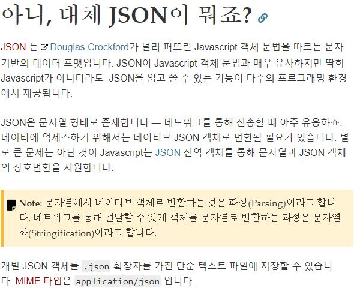

# 0430 JavaScript

---

> JS 에서 가지치기로 엄청 많이 있었는데 이를 표준화시켜서 묶은 것이ECMA (표준안)
>
> ECMA Script 6 표준안 ( ES 6+ 최신에 맞춰서 강의한다.)
>
> IE 보다 크롬을 많이 쓰는 이유는 표준에 더 부합하기 때문이다.
>
> 또 크롬이 사용자를 많이 모으게 된 계기는 V8 엔진의 속도가 무척 빨라서이다.
>
> 최초의 브라우저 : 넷스케이프
>
> J query 의 장점인 Cross Browsing 을 JS 가 갖췄기 때문에 J query는 도태되었다.
>
> ​	
>
> * 웹에서 반복문, 조건문 등을 사용하는 것이 JS
> * 파이어폭스는 암호화 같은 것이 잘 되있다.


수업은 Visual Code로 작성한다. 또 ; 세미콜론으로 인한 오류가 없기 때문에 쓰지 않는다.

```html
검사 후 console에서 쓰는 명령어

document.write("SSAFY 짱! 구글짱!!")
undefined
document.write("<h1>SSAFY 짱! 구글짱!!</h1>")
undefined
```

```javascript
const header = document.querySelector('h1')
		console.log(header.innerText)
        header.innertext = 'Happy Hacking'
```

---

```html
// alert('자바 스크립트, 안녕!')    # 한 줄 주석 처리는 //
/*  여러줄 주석처리 시 
console.log('안녕?')
console.log('bye !')
*/
document.write('<h1>SSAFY 최고</h1>')
// 변수 hoisting
// 자바스크립트에서 모든 선언과 관련된 (변수, 함수 등) 문장은 호이스팅 된다.\
// 변수는 1) 선언단계 2) 초기화 단계 3) 할당 단계를 거치게 된다.
console.log(name) // undefiend
var name = "영우"
console.log(phonenumber) // phonenumber is not defined error(Reference Error)

// let, const 키워드 (ES6+)
console.log(a)
var a = 5
console.log(a) // 에러가 발생하지 않음.

// let b = 5
// let b = 3 // 에러 발생

for (var i = 0; i < 3; i++) {
    console.log(i)
}
console.log('===============')
console.log(i) // i 값이 3임.


for (let j = 0; j < 3; j++) {
    console.log(j)
}
console.log('===============')
console.log(j)  // j 값이 없음, 오류 발생.
```

자바 스크립트의 디버깅은 `검사` -> `console` 에서 하게 된다.

* 자바 스크립트에서는 변수명 사용보다 선언을 나중에 해줘도 오류가 뜨지 않고 정상 작동된다.

  --> 자바스크립트는 읽을 때 선언되어있는 부분을 올려서 먼저 읽는다.


* JS는 변수를 선언할 때 var name 이런식으로 쓰지만 우리는  var 말고 다른 함수를 쓸 것이다.

  let, const 이다. var의 큰 단점은 한번 타입을 선언한 후에 계속 할당 값을 바꾸어 사용할 수 있는데

  그로인해 위에 var의 값이 바뀔 수 있기 때문에 좋지 않다. ( 스코프가 다르다 ! )

* let 은 재할당이 된다.(변수 재선언x ) , const  는 상수 ( = 즉 바꿀수 없는 고유값) 

* var 도 재할당이 가능하나 재선언이 되기 때문에 위험하다.
* 간단히 말해 우리는 앞으로 `let` 이랑 `const` 만 쓴다!

---

---

```html
    <script>
    // while
    let i = 0
    while (i < 10) {
        console.log(i)
        i++
    }
    // for
    for (let j=0; j < 10; j++) {
        console.log(j)
    }
    // for of : 배열 반복문
    let myArray = [1, 2, 3]
    for (let k of myArray) {
        console.log(k)
    }

    </script>
```

---

```html
# 배열에 쓸 수 있는 메소드 (JS 에서는 잘 안씀)

numbers
(4) [1, 2, 3, 4]
numbers[0]
1
numbers[-1]
undefined
numbers.length
4
numbers[2:3]
VM1134:1 Uncaught SyntaxError: Unexpected token :
numbers[0, 2]
3
numbers.reverse()
(4) [4, 3, 2, 1]
numbers
(4) [4, 3, 2, 1]
numbers.reverse()
(4) [1, 2, 3, 4]
numbers.push('push')
5
numbers
(5) [1, 2, 3, 4, "push"]
numbers.pop('push')
"push"
numbers
(4) [1, 2, 3, 4]
numbers.pop(3)
4
numbers
(3) [1, 2, 3]
numbers.push(4) # push 후 return 값은 삽입한 후의 배열길이
4
numbers
(4) [1, 2, 3, 4]
numbers.includes(1)
true
numbers.includes(5)
false
numbers.join('-')
"1-2-3-4"
numbers.indexOf(1)
0
numbers.indexOf(8)
-1
numbers
(4) [1, 2, 3, 4]
numbers.shift()
1
numbers
(3) [2, 3, 4]
numbers.unshift(1)
4
numbers
(4) [1, 2, 3, 4]
numbers.sort()
(4) [1, 2, 3, 4]
numbers.slice(0, 1)
[1]
numbers.slice(0, 3)
(3) [1, 2, 3]
numbers.slice(-2)
(2) [3, 4]
numbers.slice(1, 4) # idx가 넘치더라도 오류 안뜨고 끝까지 가져옴
(3) [2, 3, 4]
```

---

## JSON - JavaScript Object Notation

```html
-- html 스크립트 부분 --
<script>
    // 자바스크립트 데이터타입 - 원시타입(primitive type)
    // Boolean(True, False), Null, undefined, number, string

    // 자바스크립트 object 표기법
    let youngwoo = {
        name: 'youngwoo',
        age: 26,
        phonenumber: '010-8947-2935'
    }
    console.log(youngwoo.name) // 'youngwoo'
    console.log(youngwoo.age) // 26
    console.log(typeof youngwoo) // object
    console.log(typeof [1, 2, 3]) // object

    // ES6+ 주가 오브젝트 표현법
    // 변수를 그대로 넣으면, 변수명: 값
    let name = 'injeong'
    let stuffs = ['텀블러', '안경']
    let injeong = {
        name: name,
        stuffs: stuffs
    }
    // json <-> object ( json이랑 object 바꾸는 법 )
    let jsonData = JSON.stringify(injeong) // 오브젝트를 json 문자열로 바꿔주고
    let jsonParse = JSON.parse(jsonData) // json 문자열을 json 오브젝트로 바꿔주는 구조
    </script>

-- '검사'의 'console' 부분 --
youngwoo.name
"youngwoo"
youngwoo.age
26
youngwoo.phonenumber
"010-8947-2935"
youngwoo['age']
26
youngwoo.email
undefined
typeof youngwoo.age
"number"
typeof youngwoo
"object"
---
injeong.stuffs
(2) ["텀블러", "안경"]
injeong
{name: "injeong", stuffs: Array(2)}
---
injeong
{name: "injeong", stuffs: Array(2)}
jsonData
"{"name":"injeong","stuffs":["텀블러","안경"]}"
let jsonParse = JSON.parse(jsonData)
undefined
jsonParse
{name: "injeong", stuffs: Array(2)}
```



---

## 05 함수

```html
<script>
// 1. 함수 선언식
let result = add(1, 3)
function add(num1, num2) {
    return num1+num2
}
console.log(result)
// 2. 함수 표현식
let add2 = function (num1, num2) {
    return num1+num2
}
console.log(add2(1, 3))
// console.log(add3(1, 3))

// ES6+ Arrow Function
let sub = (num1, num2) => { // arrow function = >
    return num1-num2
}

// 인자가 하나인 경우, () 생략가능
// 단순 리턴인 경우, {} 및 리턴 키워드 생략 가능
let greeting = name => `${name}, 안녕!`
console. log(greeting('인정'))
let mul = (num1, num2) => num1 * num2
console.log(mul(5, 4))

// 인자가 없는 경우에는 () 작성
let hellow = () => 'hello, world!'
console.log(hellow())
// object 리턴 시 반드시 ()묶어서 작성
// let me
let me = (name, age) => ({name, age}) // return을 못해준다. undefined
console.log(me('hi', 3))

// 만약, default args (기본인자)
let bonjour = (name='동명') => `${name}, bonjour`

// 4. 익명 함수
(function (num) {return num*num})

// 5. 즉시 실행 함수 (익명함수 + 호출) - IIFE (Immediately Invoked Function Expression)
( num => num*num )(5)

let myNum = (function(num) {return num})

// 배열을 받아서 다 더해주는 함수를 작성 해주세요.
    // numberAddEach(numbers)

    const numberAddEach = numbers => {
        let sum = 0
        for (let number of numbers) {
            sum += number
        }
        return sum
    }
    console.log(numberAddEach([1, 2, 3]))

    const numberSubEach = numbers => {
        let sum = 0
        for (let number of numbers) {
            sum -= number
        }
        return sum
    }
    console.log(numberSubEach([1, 2, 3]))

    const numberMulEach = numbers => {
        let sum = 1
        for (let number of numbers) {
            sum *= number
        }
        return sum
    }
    console.log(numberMulEach([1, 2, 3]))

    const numberEach = (numbers, calc) => {
        let result 
        for (const number of numbers) {
            result = calc(number, result)
        }
        return result
    }

    const addEach = (number, result=0) => result + number
    const subEach = (number, result=0) => result - number
    const mulEach = (number, result=1) => result * number
    // 콜백 callback 
    console.log(numberEach([10, 20, 30], addEach))
    console.log(numberEach([10, 20, 30], subEach))
    console.log(numberEach([10, 20, 30], mulEach))
    // 익명함수 + 콜백
    console.log(numberEach([10, 20, 30], (number, result=0) => result + number))
    console.log(numberEach([10, 20, 30], function(number, result=0) {
        return result + number 
    }))
</script>
```

```console
const negative = num => -1*num
undefined
negative(5)
-5
const gutenTag = () => 'Guten Tag'
undefined
gutenTag()
"Guten Tag"
const vietnam = member => {
    let member_base = '황여진'
    return `${member_base}와 ${member}가 베트남에 가요.`}
undefined
vietnam('이민지')
"황여진와 이민지가 베트남에 가요."
---
let bonjour = (name='동명') => `${name}, bonjour`
undefined
bonjour
(name='동명') => `${name}, bonjour`
bonjour('성민')
"성민, bonjour"
bonjour()
"동명, bonjour"
(function (num) {return num*num})
ƒ (num) {return num*num}
num => num*num
num => num*num
(function (num) {return num*num})(5)
25
```

자바스크립트의 함수는 일급 객체이다.


-조건-

1. 변수나 특정한 오브젝트(배열) 함수를 지정할 수 있다. 
2. 함수의 인자로 전달할 수가 있어야 한다.
3. 함수 자체를 return 할 수 있어야 한다.
4. 이름과 상관없이 구별이 가능하다.(익명으로 표현 가능)


1. let, const

2. ==, ===

3. function

   arrow function

   익명함수

---


'*'Infinite : 콜백.......

* 추가적으로...

```javascript
//  ? 는 상황 연산자로서 앞의 조건이 맞다면 true 틀리면 false를 반환한다.
return string.length > 10 ? true : false
						// 조건이 바뀌어도 상관 x true 자리에 console.log(~~) 가 들어가도됨
// 애로우와 상황연산자로 함수를 한 줄로 줄인 것
const checkLongStr = string => (string.length > 10 ? true : false)
```

